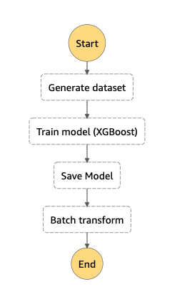
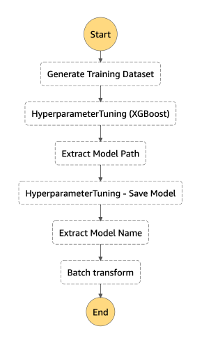

# Day 1

* Information on official [Sklearn Docker images](https://github.com/aws/sagemaker-python-sdk/tree/master/src/sagemaker/sklearn#sagemaker-scikit-learn-docker-containers)
* How to write [custom Debugger Rules](https://github.com/awslabs/sagemaker-debugger/blob/master/docs/analysis.md#Writing-a-custom-rule)
* Separating preprocessing logic from model inference by [splitting scripts into pipelines](https://docs.aws.amazon.com/sagemaker/latest/dg/inference-pipelines.html).
* Scheduling Jobs outside of notebooks with [AWS Step Functions](https://docs.aws.amazon.com/step-functions/latest/dg/welcome.html)
    * AWS Step Functions is a web service that enables you to coordinate the components of distributed applications and microservices using visual workflows.
    * Examples
        * [Kick off a SageMaker Training Job](https://docs.aws.amazon.com/step-functions/latest/dg/sample-train-model.html)
            * 
        * [Kick off a SageMaker Model Tuning Job](https://docs.aws.amazon.com/step-functions/latest/dg/sample-hyper-tuning.html)
            * 

# Day 2

#### Does AutoTune perform feature engineering or just automatic model selection?

> Amazon SageMaker Autopilot simplifies the machine learning experience by helping you explore your data and try different algorithms. It also automatically trains and tunes models on your behalf, to help you find the best algorithm. You simply upload tabular data in a file with comma-separated values (for example, from a spreadsheet or database), choose the target column to predict, and Autopilot builds a predictive model for you. These predictions can take the form of ordered numerical values (i.e., this is a regression model) or the form of categories (i.e., a classification model). Autopilot explores different combinations of data preprocessors, algorithms, and algorithm parameter settings to find an accurate model, similar to how a data scientist would, making it easier for novices to get started.

See [Use Amazon SageMaker Autopilot to Automate Model Development](https://docs.aws.amazon.com/sagemaker/latest/dg/autopilot-automate-model-development.html) for more details.

I was curious about how this worked so I ran an experiment on my own. Very cool stuff! Here is a breakdown of the new files:

* `notebooks/06_autotune.ipynb` - I created a notebook to upload some tabular data to S3 for the AutoTune job.
* `notebooks/06a_SageMakerAutopilotDataExplorationNotebook.ipynb` - Notebook auto-generated by SageMaker to perform data exploration.
* `notebooks/06b_SageMakerAutopilotCandidateDefinitionNotebook.ipynb` - Notebook auto-generated by SageMaker to perform model selection.
* `xgb-autotune-0417-0657-artifacts/` - Directory of artifacts created by AutoTune. These were downloaded from S3 and contain the Python scripts that AutoTune generates with feature preprocessing steps.

#### Are there limits on the rate at which Batch Transform jobs can be started?

> Amazon SageMaker quotas for new accounts might be different from the default quotas listed here. If you receive an error that you've exceeded your quota, contact customer service to request a quota increase for the resources you want to use. On-demand and Spot instance quotas are tracked and modified separately. For example, with the default quotas, you could run up to 20 training jobs with on-demand ml.m4.xlarge instances and up to 20 training jobs with Managed Spot ml.m4.xlarge instances simultaneously. Request quota increases for on-demand and spot instances separately.

See the table titled **Amazon SageMaker Batch Transform** under the [Service Quotas](https://docs.aws.amazon.com/general/latest/gr/sagemaker.html#limits_sagemaker) section of the [Amazon SageMaker endpoints and quotas](https://docs.aws.amazon.com/general/latest/gr/sagemaker.html) page.

